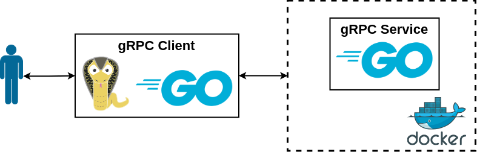

# hostsetup

## Requirementts

- docker 26.0.0

## About

The utility allows you to set the host name in Linux and change the list of DNS servers.

## Docs

You can use the following commands:

- `hostsetup set-hostname` - set the host name
- `hostsetup list-dns-servers` - show the list of DNS servers
- `hostsetup add-dns-server` - add a DNS server
- `hostsetup delete-dns-server` - delete the DNS server.

## Run